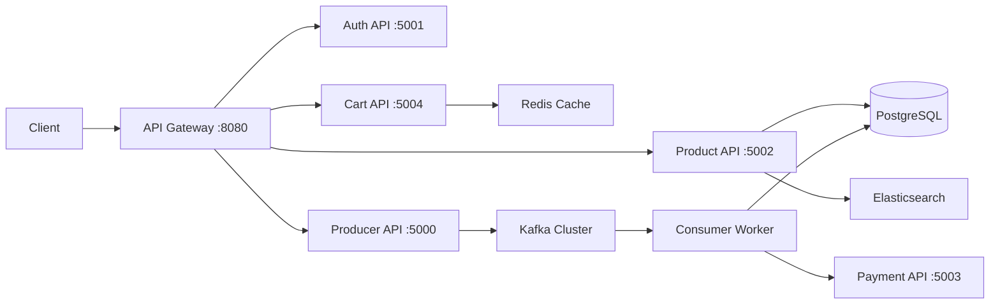

# 🛒 MicroShop Backend

<div align="center">


**Enterprise-grade microservices architecture for scalable e-commerce solutions**

[Architecture](#-architecture) • [Quick Start](#-quick-start) • [Tech Stack](#-tech-stack) • [API Documentation](#-api-endpoints) • [Contributing](#-contributing)

</div>

---

## 📋 Overview

MicroShop Backend is a production-ready, event-driven e-commerce platform built on **ASP.NET Core 8** microservices architecture. Designed for high availability and horizontal scalability, it leverages industry-standard technologies including Apache Kafka for event streaming, Redis for distributed caching, and Elasticsearch for intelligent product search.

**Enterprise patterns implemented**: CQRS, Event Sourcing, API Gateway, Circuit Breaker, and Distributed Transactions.

---

## 🏗 Architecture

<details open>
<summary><b>Microservices Overview</b></summary>

### Service Topology

| Service | Responsibility | Technology | Port |
|---------|---------------|------------|------|
| **API Gateway** | Unified entry point, routing, rate limiting | Ocelot | `8080` |
| **Auth API** | Authentication, authorization, JWT management | ASP.NET Identity | `5001` |
| **Product API** | Catalog management, inventory tracking | EF Core + Elasticsearch | `5002` |
| **Payment API** | Payment processing, transaction validation | Dapper | `5003` |
| **Cart API** | Session management, cart persistence | Redis | `5004` |
| **Producer API** | Order orchestration, event publishing | Kafka Producer | `5000` |
| **Consumer Worker** | Asynchronous order processing | Kafka Consumer | N/A |

### Data Flow



</details>

<details>
<summary><b>🎯 Core Capabilities</b></summary>

### Architectural Patterns
- **CQRS (Command Query Responsibility Segregation)**: Separate read/write operations for optimal performance
- **Event Sourcing**: Complete audit trail through Kafka event streams
- **API Gateway Pattern**: Centralized routing with Ocelot for cross-cutting concerns
- **Circuit Breaker**: Resilience through Polly retry policies

### Performance Features
- **Distributed Caching**: Redis-backed cart operations with sub-millisecond response times
- **High-Speed Queries**: Dapper for performance-critical database operations
- **Full-Text Search**: Elasticsearch integration for advanced product discovery
- **Asynchronous Processing**: Kafka-driven order fulfillment pipeline

### Infrastructure
- **Containerization**: Complete Docker orchestration with Compose
- **Database Per Service**: PostgreSQL instances for data isolation
- **Message Broker**: Apache Kafka with Zookeeper coordination
- **Service Discovery**: Built-in health checks and monitoring endpoints

</details>

---

## 🚀 Quick Start

### Prerequisites

| Requirement | Version | Download |
|------------|---------|----------|
| Docker Desktop | 20.10+ | [Get Docker](https://www.docker.com/products/docker-desktop) |
| .NET SDK | 8.0+ | [Get .NET](https://dotnet.microsoft.com/download) |
| Docker Compose | 2.0+ | Included with Docker Desktop |

### Installation

```bash
# Clone the repository
git clone https://github.com/rahul-raj1709/microshop-backend.git
cd microshop-backend

# Start all services with Docker Compose
docker-compose up --build -d

# Verify all containers are running
docker-compose ps

# View aggregated logs
docker-compose logs -f
```

### Health Check

```bash
# Check API Gateway
curl http://localhost:8080/health

# Check individual services
curl http://localhost:5001/health  # Auth API
curl http://localhost:5002/health  # Product API
curl http://localhost:5004/health  # Cart API
```

### Stopping Services

```bash
# Stop all services
docker-compose down

# Stop and remove volumes (clean slate)
docker-compose down -v
```

---

## 🛠 Tech Stack

<details open>
<summary><b>Backend Technologies</b></summary>

| Category | Technology | Purpose |
|----------|-----------|---------|
| **Framework** | ASP.NET Core 8 | Web API development |
| **Language** | C# 12 | Primary development language |
| **Database** | PostgreSQL 15 | Relational data storage |
| **ORM** | EF Core 8 + Dapper | Object mapping & micro-ORM |
| **Caching** | Redis 7 | Distributed cache & session store |
| **Search** | Elasticsearch 8 | Full-text search engine |
| **Messaging** | Apache Kafka 3.6 | Event streaming platform |
| **Gateway** | Ocelot | API Gateway & routing |
| **Authentication** | ASP.NET Identity + JWT | User management & security |
| **Validation** | FluentValidation | Request validation |
| **Resilience** | Polly | Retry & circuit breaker policies |
| **Documentation** | Swagger/OpenAPI | API documentation |
| **Containerization** | Docker + Compose | Service orchestration |

</details>

<details>
<summary><b>Development Tools</b></summary>

- **IDE**: Visual Studio 2022 / VS Code with C# Dev Kit
- **API Testing**: Postman / Insomnia
- **Database Management**: pgAdmin / DBeaver
- **Cache Inspection**: RedisInsight
- **Log Aggregation**: Kafka UI / Elasticsearch Kibana

</details>

---

## 📂 Project Structure

```text
microshop-backend/
├── src/
│   ├── ApiGateway/
│   │   ├── ocelot.json              # Routing configuration
│   │   ├── Program.cs
│   │   └── appsettings.json
│   │
│   ├── AuthAPI/
│   │   ├── Controllers/
│   │   │   └── AuthController.cs    # Login, Register, Refresh Token
│   │   ├── Data/
│   │   │   └── AuthDbContext.cs
│   │   ├── Models/
│   │   │   ├── User.cs
│   │   │   └── LoginRequest.cs
│   │   └── Services/
│   │       └── TokenService.cs      # JWT generation
│   │
│   ├── ProductAPI/
│   │   ├── Controllers/
│   │   │   └── ProductsController.cs # CRUD + Search
│   │   ├── Data/
│   │   │   └── ProductDbContext.cs
│   │   ├── Models/
│   │   │   └── Product.cs
│   │   └── Services/
│   │       ├── ProductService.cs
│   │       └── ElasticsearchService.cs
│   │
│   ├── CartAPI/
│   │   ├── Controllers/
│   │   │   └── CartController.cs    # Add, Remove, Clear
│   │   ├── Models/
│   │   │   └── CartItem.cs
│   │   └── Services/
│   │       └── RedisCartService.cs  # Redis operations
│   │
│   ├── PaymentAPI/
│   │   ├── Controllers/
│   │   │   └── PaymentController.cs # Process payments
│   │   ├── Models/
│   │   │   └── PaymentRequest.cs
│   │   └── Services/
│   │       └── PaymentService.cs    # Mock payment gateway
│   │
│   ├── ProducerAPI/
│   │   ├── Controllers/
│   │   │   └── OrdersController.cs  # Create orders
│   │   ├── Models/
│   │   │   └── Order.cs
│   │   └── Services/
│   │       └── KafkaProducerService.cs
│   │
│   └── ConsumerWorker/
│       ├── Worker.cs                # Background service
│       └── Services/
│           └── OrderProcessingService.cs
│
├── tests/
│   ├── AuthAPI.Tests/
│   ├── ProductAPI.Tests/
│   └── CartAPI.Tests/
│
├── docker-compose.yml               # Complete orchestration
├── .dockerignore
└── README.md
```

---

## 🔌 API Endpoints

<details>
<summary><b>Authentication Endpoints</b></summary>

### Base URL: `http://localhost:8080/auth`

| Method | Endpoint | Description | Auth Required |
|--------|----------|-------------|---------------|
| POST | `/register` | Create new user account | ❌ |
| POST | `/login` | Authenticate user, get JWT | ❌ |
| POST | `/refresh` | Refresh access token | ✅ |
| GET | `/profile` | Get current user profile | ✅ |

</details>

<details>
<summary><b>Product Endpoints</b></summary>

### Base URL: `http://localhost:8080/products`

| Method | Endpoint | Description | Auth Required |
|--------|----------|-------------|---------------|
| GET | `/` | List all products (paginated) | ❌ |
| GET | `/{id}` | Get product by ID | ❌ |
| GET | `/search?q={query}` | Search products (Elasticsearch) | ❌ |
| POST | `/` | Create new product | ✅ Admin |
| PUT | `/{id}` | Update product | ✅ Admin |
| DELETE | `/{id}` | Delete product | ✅ Admin |

</details>

<details>
<summary><b>Cart Endpoints</b></summary>

### Base URL: `http://localhost:8080/cart`

| Method | Endpoint | Description | Auth Required |
|--------|----------|-------------|---------------|
| GET | `/` | Get current cart | ✅ |
| POST | `/items` | Add item to cart | ✅ |
| PUT | `/items/{id}` | Update item quantity | ✅ |
| DELETE | `/items/{id}` | Remove item from cart | ✅ |
| DELETE | `/` | Clear entire cart | ✅ |

</details>

<details>
<summary><b>Order Endpoints</b></summary>

### Base URL: `http://localhost:8080/orders`

| Method | Endpoint | Description | Auth Required |
|--------|----------|-------------|---------------|
| POST | `/` | Create order (publishes to Kafka) | ✅ |
| GET | `/` | Get user's order history | ✅ |
| GET | `/{id}` | Get order details | ✅ |

</details>

---

## 🧪 Testing

```bash
# Run all tests
dotnet test

# Run specific service tests
dotnet test tests/AuthAPI.Tests

# Run with coverage
dotnet test /p:CollectCoverage=true /p:CoverageReportFormat=opencover
```

---

## 🔐 Security Features

- **JWT Authentication**: Stateless authentication with refresh token support
- **Password Hashing**: BCrypt with configurable work factor
- **CORS Configuration**: Controlled cross-origin access
- **Input Validation**: FluentValidation on all endpoints
- **SQL Injection Prevention**: Parameterized queries via Dapper/EF Core
- **Rate Limiting**: Gateway-level throttling (configurable in Ocelot)

---

## 📊 Monitoring & Observability

### Health Checks
Each service exposes `/health` endpoints compatible with orchestration tools like Kubernetes.

### Logging
Structured logging using **Serilog** with sinks for:
- Console output (development)
- Elasticsearch (production)
- Application Insights (optional)

### Metrics
- Kafka consumer lag monitoring
- Redis cache hit rates
- API Gateway request latency

---

## 🤝 Contributing

Contributions are welcome! Follow these guidelines:

1. **Fork** the repository
2. **Create** a feature branch following naming convention: `feature/service-name-feature-description`
3. **Follow** C# coding standards (refer to preferences in system prompt)
4. **Write** unit tests using XUnit, FakeItEasy, and FluentAssertions
5. **Commit** with clear messages following [Conventional Commits](https://www.conventionalcommits.org/)
6. **Push** to your branch
7. **Open** a Pull Request with detailed description

### Code Standards
- Use modern C# features (records, primary constructors, file-scoped namespaces)
- Follow SOLID principles and DDD patterns
- Maintain test coverage above 80%
- Document public APIs with XML comments

---

## 📄 License

This project is licensed under the **MIT License** - see the [LICENSE](LICENSE) file for details.

---

## 🗺️ Roadmap

- [ ] **Observability**: Integrate OpenTelemetry for distributed tracing
- [ ] **Security**: Implement OAuth2/OIDC with IdentityServer
- [ ] **Deployment**: Kubernetes manifests with Helm charts
- [ ] **CI/CD**: GitHub Actions pipelines for automated testing & deployment
- [ ] **Documentation**: Comprehensive API documentation with Scalar/Redoc
- [ ] **Notifications**: Email/SMS service with templating engine
- [ ] **Analytics**: Real-time dashboards with Grafana

---

## 📧 Contact

**Rahul Raj** - [@rahul-raj1709](https://github.com/rahul-raj1709)

Project Link: [https://github.com/rahul-raj1709/microshop-backend](https://github.com/rahul-raj1709/microshop-backend)

---

<div align="center">

**⭐ Star this repository to support the project!**

Built with modern C# practices and enterprise patterns

[Report Bug](https://github.com/rahul-raj1709/microshop-backend/issues) • [Request Feature](https://github.com/rahul-raj1709/microshop-backend/issues)

</div>
